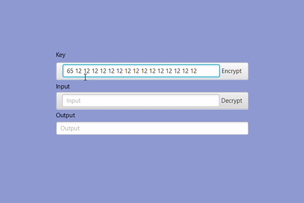

# Zhvillimi i aplikacionit që mundëson enkriptimin me AES


Universiteti i Prishtinës - Fakulteti i Inxhinierisë Elektrike dhe Kompjuterike

#### Detyra e tretë në lëndën: Siguria në internet

## Përmbajtja e projektit

AplikacioniAES është projekt që përdoret si aplikacion për enkriptim dhe dekriptim të tekstit që ne e dërgojmë si hyrje me çelësin përkatës.
<p> 
Në këtë projekt kemi përdorur jdk19, javafx si dhe maven i cili është mjet për menaxhimin e projektit në gjuhën programuese Java i bazuar në POM (Project Object Model).
</p>

* Për të klonuar këtë projekt në mjedisin tuaj lokal, thjeshtë shënoni në get from version control url:
```
https://github.com/Blerina2/aplikacioniAES.git
```
* Ky projekt është ndërtuar në Intellij IDEA Ultimate (Linku për download: https://www.jetbrains.com/idea/download/#section=windows)

> **_INFO:_** Nëse jeni profesor/student mund të merrni një licencë JetBrains falas për të gjitha produktet (programming tools) duke përdorur email-in tuaj të universitetit (Linku përkatës: https://www.youtube.com/watch?v=1Bc5w05j-i8)

* Kjo mund të funksionoj në platforma të tjera, nëse janë këto teknologji të instaluar:

| Technology used | Version                      | 
|-----------------|------------------------------|
| Java            | OpenJDK-19                   |  
| Maven           | build- dependency management |  
| Javafx          | 0.0.8                        |
| eu.hansolo      | 11.1                         |

## Parakushtet

##### Cilat gjëra ju nevojiten për të instaluar softuerin dhe si t'i instaloni ato?


* Javafx: (Instalimi: https://www.youtube.com/watch?v=XEdd5PQ34Lo)
* Maven (në disa tools është build-in): (Instalimi: https://www.youtube.com/watch?v=WASIyomqarc)

<p></p>

* eu.hansolo konfigurohet duke shkuar në file pom.xml dhe ndryshuar versionin përkatës në 11.1 (nëse është versioni 11.1 paraprakisht atëherë nuk është i nevojshëm ndryshimi):


# Si punon aplikacioni?

1. Duke e bërë run projektin nga klasa AesApplication.java do të shfaqet një pop-up:


2. Key mund të ndryshohet me kusht se duhet të jetë max:128 bit

* #### Për të enkriptuar një fjali (si dhe shfaqja e mundësisë së ndërrimit të key) duhet të veprohet në ketë mënyrë: 



* #### Për të dekriptuar duhet të veprohet në ketë mënyrë:


Projekti është punuar nga:
```
Blerina Beka
Erëza Ismajli
```

Profesori i lëndës:
 
<pre>PhD.c Mërgim Hoti </pre>
